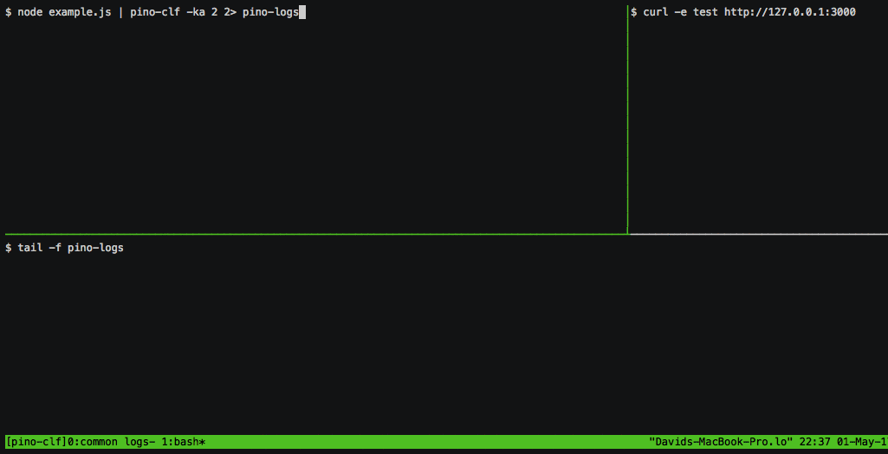

# pino-clf &nbsp; &nbsp;[![stability][0]][1]
[![npm version][2]][3] [![build status][4]][5] [![test coverage][6]][7] [![dependencies freshness][14]][15] [![js-standard-style][10]][11]

Transform Pino HTTP logs into Common Log Format.

This CLI tool and module is a transform [transport](https://github.com/pinojs/pino/blob/master/docs/transports.md) for the [pino](http://npm.im/logger) which outputs [Common Log Format](https://en.wikipedia.org/wiki/Common_Log_Format).



## Supports

* [express-pino-logger](http://npm.im/express-pino-logger)
* [restify-pino-logger](http://npm.im/restify-pino-logger)
* [koa-pino-logger](http://npm.im/koa-pino-logger)
* [pino-http](http://npm.im/pino-http)
* [hapi-pino](http://npm.im/hapi-pino)

## Usage

```sh
$ npm install -g pino-clf
```

```sh
$ pino-clf -h
```

```sh
  
    pino-clf [-d] [-k] [-a] type

    type                common | combined (default)

    -d | --dest |       stderr | stdout (default) or Number or Array of Numbers
    --destination       Specify file descriptor(s) to send log(s) to [access, referral, agent]
    
    -a | --ancillary    stderr | stdout or Number. Specify JSON logs fd
    
    -k | --keep         true | false (default) Retain transformed logs in ancillary output

```

### Common Log Format

The Common Log Format is a frequently used log format, that has a very mature and well 
established ecosystem built around it. 

It takes two forms: "Combined" and "Common".

When the type is "Common" this can break down into (up to) three separate log streams:

* Access log (also known as Common log)
* Referall log
* Agent log

Access log example:

```
127.0.0.1 - Aladdin [21/Jul/2016:17:34:52 -0060] "GET /api/activity/component HTTP/1.1" 200 -
```

Referral log example:

```
[21/Jul/2016:17:34:52 -0060] "http://localhost:20000/"
```

Agent log example:

```
[21/Jul/2016:17:34:52 -0060] "Mozilla/5.0 (Macintosh; Intel Mac OS X 10_11_1) AppleWebKit/537.36 (KHTML, like Gecko) Chrome/51.0.2704.103 Safari/537.36"
```

The "Combined" format combines all three formats into one, for instance: 

```
127.0.0.1 - Aladdin [21/Jul/2016:17:34:52 -0060] "GET /api/activity/component HTTP/1.1" 200 - "http://localhost:20000/" "Mozilla/5.0 (Macintosh; Intel Mac OS X 10_11_1) AppleWebKit/537.36 (KHTML, like Gecko) Chrome/51.0.2704.103 Safari/537.36"
```


### Example

Spin up a server that uses a pino http logger (see the [Supports](#supports) section),
pipe it to `pino-clf` and desribe the format in tokenized form

```sh
$ node server | pino-clf
127.0.0.1 - Aladdin [21/Jul/2016:17:34:52 -0060] "GET /api/activity/component HTTP/1.1" 200 - "http://localhost:20000/" "Mozilla/5.0 (Macintosh; Intel Mac OS X 10_11_1) AppleWebKit/537.36 (KHTML, like Gecko) Chrome/51.0.2704.103 Safari/537.36"
```

The default output is Combined. To use three log output use the `-d` flag and specify
up to three file descriptors (first is access log, second referral log, third agent log):

```sh
node server | pino-clf -d [3,4,5] 3>> ./access.log 4>> ./referral.log 5>> ./agent.log
```

The above will append the Access, Agent, and Referral logs to each corresponding log file.

We can skip the middle log (referall) by using an file desriptor of `0` or `null` as the 
middle element:

```sh
node server | pino-clf -d [3,0,4] 3>> ./access.log 4>> ./agent.log
```


## Destination (`-d`)

By default, logs are output to STDOUT, however we can set the `-d` (alias, `--dest`, `--destination`), flag to a a `stderr`, or a number (`1` for stdout, `2` for stderr, `3` or more for custom file descriptor):

```sh
$ node server | pino-clf -d stderr
```

The above is equivalent to:

```sh
$ node server | pino-clf -d 2 combined
```

We can also direct formatted log output to custom file descriptors, but we *must*
use bash redirection (in some form) from that file descriptor, otherwise the process
will most likely immediately crash (this is to do with how unix works).

```sh
$ node server | pino-clf -d 8 8> ./combined.log
```

## Ancillary Output (`-a`)

By default, any logs which aren't an HTTP log (meaning, they don't have `req` and `res`
properties and the `msg` isn't "request complete") are filtered out.

However, we can specify an ancillary (secondary) output for other log messages, using
the `-a` (alias `--ancillary`) flag.

The following will write reformatted HTTP logs to STDOUT and original JSON logs
which *are not* HTTP logs to STDERR.

```sh
$ node server | pino-clf -a 2 -d 1
```

## Keep Original HTTP JSON Logs (`-k`)

The `-a` (`--ancillary`) flag can be coupled with the `-k` (`--keep`) flag so that
raw HTTP JSON logs are also piped to the ancillary output stream, along with any
filtered output.

The following will pipe all formatted logs to the `4` file descriptor which is redirected to a file,
while *all* original JSON logs (instead of non-HTTP logs) are written to STDOUT.

```
$ node server | pino-clf -k -a 1 -d 4 4> ./combined.logs
```

### Programmatic API

#### clf(type?, destination?, ancillary?)

Returns a stream that we write Pino JSON logs to.


##### type (String | Object)

* combined (default)
* common 

If object form type is `{type, keep}`

* `keep` (Boolean, `false`) - preserve original HTTP Logs, as well as other JSON logs when writing to ancillary stream

##### destination (Stream | Array<Stream>)

Stream or streams to write output to.

If the type is `common` destination can be an `array` of 
up to three streams, to enable the three log 
output format. 

* destination[0] - access log
* destination[1] - referral log
* destination[2] - agent log

##### ancillary (Stream)

Stream to output original JSON logs to.


## LICENSE

MIT

## Acknowledgements

* Inspired by the [`morgan`](http://npm.im/morgan) logger
* Sponsored by [nearForm](http://nearform.com)


[0]: https://img.shields.io/badge/stability-stable-green.svg?style=flat-square
[1]: https://nodejs.org/api/documentation.html#documentation_stability_index
[2]: https://img.shields.io/npm/v/pino-clf.svg?style=flat-square
[3]: https://npmjs.org/package/pino-clf
[4]: https://img.shields.io/travis/pinojs/pino-clf/master.svg?style=flat-square
[5]: https://travis-ci.org/pinojs/pino-clf
[6]: https://img.shields.io/codecov/c/github/pinojs/pino-clf/master.svg?style=flat-square
[7]: https://codecov.io/github/pinojs/pino-clf
[8]: http://img.shields.io/npm/dm/pino-clf.svg?style=flat-square
[9]: https://npmjs.org/package/pino-clf
[10]: https://img.shields.io/badge/code%20style-standard-brightgreen.svg?style=flat-square
[11]: https://github.com/feross/standard
[12]: https://npm.im/debug
[13]: https://npm.im/github/pinojs/pino
[14]: https://david-dm.org/pinojs/pino-clf/status.svg
[15]: https://david-dm.org/pinojs/pino-clf

